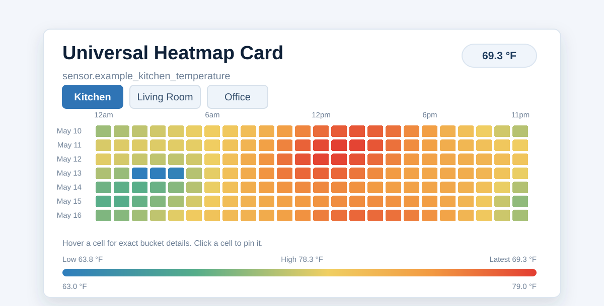

# Universal Heatmap Card

A Home Assistant custom card for reusable time-bucket heatmaps across numeric sensors, units, and update frequencies.

[](docs/images/demo-heatmap.svg)

The SVG above is a self-contained synthetic demo when opened directly: room tabs,
cell hover/click details, and a link to the full local demo harness. README
previews may render it as a static image.

This first pass is intentionally focused:

- Numeric single-entity and multi-entity heatmaps.
- Home Assistant recorder statistics via `hass.callWS`.
- Short-range REST history fallback when statistics are unavailable.
- Canvas rendering for the heatmap body.
- HACS-ready `dist/universal-heatmap-card.js` output.
- YAML configuration with a graphical editor for common single- and multi-entity setup.

## Install With HACS

Until this is added to the default HACS store, install it as a custom repository:

1. In Home Assistant, open HACS.
2. Open the three-dot menu and choose **Custom repositories**.
3. Add `https://github.com/gcs8/universal-heatmap-card` as category **Dashboard**.
4. Download **Universal Heatmap Card**.
5. Confirm the dashboard resource points at `/hacsfiles/universal-heatmap-card/universal-heatmap-card.js`.

Then refresh the browser and use `type: custom:universal-heatmap-card` in a dashboard card.

## Install For Local Testing

Build the card:

```sh
npm ci --ignore-scripts
npm run build
```

Copy `dist/universal-heatmap-card.js` into Home Assistant's `/config/www/` directory, then add this dashboard resource:

```yaml
url: /local/universal-heatmap-card.js
type: module
```

Use the card:

```yaml
type: custom:universal-heatmap-card
entity: sensor.living_room_temperature
range:
  days: 30
bucket:
  interval: day
  value: mean
scale:
  preset: temperature
```

## Multi-Entity Example

```yaml
type: custom:universal-heatmap-card
title: Example Power
entities:
  - entity: sensor.example_power_a
    name: A
  - entity: sensor.example_power_b
    name: B
  - entity: sensor.example_total_power
    name: Total
range:
  days: 14
  align: day
bucket:
  interval: hour
  value: mean
scale:
  min: 0
  max: 2500
data:
  refresh_interval: 300
  defer_until_visible: true
  max_concurrent_requests: 2
layout:
  bound_to_grid: auto
navigation:
  mode: tabs
```

## Time Window Alignment

By default, ranges use fixed local days so hourly columns stay stable from local `00:00` through `23:59`. This keeps daily heatmaps visually comparable as the day moves on:

```yaml
range:
  days: 14
  align: day # optional, because day is the default
```

Set `range.align: rolling` when the moving "last N hours/days ending now" behavior is preferred:

```yaml
range:
  hours: 24
  align: rolling
```

## Axes And Legend

Axis tick labels are shown by default. The extra explanatory key is off by default because it is redundant when the graph is already well labeled:

```yaml
axes:
  show: true
  x_labels: true
  y_labels: true
  show_key: false
```

Set `axes.show_key: true` when you want the card to explicitly spell out the encoding, for example `X = time of day`, `Y = date`, and `Color = average value`.

By default, color scales use the observed bucket values in the rendered time window unless you set fixed `scale.min` or `scale.max`. For positive sensors, `scale.ignore_zero: auto` keeps an isolated zero from flattening a large active range.

Scale tuning is optional:

```yaml
scale:
  # > 1 pushes colors farther from the midpoint; < 1 softens contrast.
  sensitivity: 1.4
  # 2 trims the auto-scale domain to the 2nd through 98th percentiles.
  outlier_clip: 2
```

Use `sensitivity` when close values need more visual separation or noisy/peaky values need less drama. Use `outlier_clip` when rare spikes should not define the whole color range. Fixed `scale.min` and `scale.max` still win when set.

## Sections Dashboard Sizing

Home Assistant sections dashboards use a 12-column grid with 56px rows and 8px gaps. The card's `getGridOptions()` reports section rows from an estimated rendered height using that official sizing model. If a dashboard also has saved `grid_options.rows`, the card treats those rows as a height budget and caps the canvas only while it can keep readable cells instead of pushing into the next section:

```yaml
layout:
  # auto bounds only when grid_options.rows exists.
  bound_to_grid: auto
```

Set `layout.bound_to_grid: false` if you are using `grid_options` outside a sections dashboard and want the card to keep natural height.

For manually saved wide sections, make the card columns match the section span. A 2-wide section is 24 card-grid columns:

```yaml
column_span: 2
cards:
  - type: custom:universal-heatmap-card
    grid_options:
      columns: 24
```

## Debug And Performance

Debug logging is off by default. Enable it only while diagnosing a card:

```yaml
debug: true
```

You can also enable it temporarily from the browser console:

```js
localStorage.setItem("universal-heatmap-card:debug", "1");
```

Debug logs report cache hits/stales, provider source, bucket counts, scale bounds, and load/draw timings. They do not print Home Assistant tokens or raw recorder rows, but they may include entity IDs and value ranges.

Run the lightweight render-path proxy harness locally:

```sh
npm run perf
npm run perf:stress
```

CI runs `npm run ci:guard` to block accidental resource hogs such as scheduled workflows, unbounded matrix jobs, missing job timeouts, or npm installs without `--ignore-scripts`. The perf harness stays manual so push/PR CI remains cheap.

## Data Refresh

The card caches each rendered entity/range/bucket/scale query for five minutes by default. This keeps normal Home Assistant state updates from repeatedly querying recorder history. The value is a minimum cache age, not a background polling timer:

```yaml
data:
  # Seconds. Set to 0 to cache until the card config changes.
  refresh_interval: 300
  # Keep off-screen cards from querying recorder until they scroll near view.
  defer_until_visible: true
  # Shared browser-side cap across all universal heatmap card instances.
  max_concurrent_requests: 2
```

## Supported Data And Limits

- Numeric sensors with recorder statistics are the primary supported data path. The card queries Home Assistant from the browser with `recorder/statistics_during_period`.
- Short raw-history fallback is available for values that are not in recorder statistics, but it is capped by `data.raw_history_hours` to avoid large browser-side history pulls.
- Dense windows are bounded by `data.max_cells`; raise it deliberately if you really want a larger grid.
- Wide dashboards are protected by lazy loading and a shared request queue. Off-screen cards wait until they are near the viewport, repeated Home Assistant state updates reuse the in-flight load for the same card, and `data.max_concurrent_requests` defaults to `2`.
- Multi-entity cards work best when all entities share comparable bucket semantics and units. Per-entity `scale` overrides are supported.
- Binary runtime aggregation is planned, but not ready yet. `percent_on` and `duration_on` are reserved bucket values for that pass.
- The graphical editor covers common single- and multi-entity options, including reordered entity lists, entity display aliases, fixed/rolling alignment, scale preset, fixed min/max, sensitivity, and outlier clipping. Use YAML mode for custom color stops, per-entity scale overrides, and unusual nested config.
- Compare mode is not included yet.

## Development

```sh
npm ci --ignore-scripts
npm test
npm run ci:guard
npm run perf
npm run build
```

Run the local demo harness:

```sh
npm run dev
```

Then open `http://localhost:5173/demo/`.

Regenerate the standalone interactive SVG used in this README:

```sh
npm run docs:demo-svg
```

### Local Home Assistant Fixture

The demo can switch between generated data and a local static Home Assistant export. The real fixture and local sync config are intentionally gitignored.

Create `demo/fixtures/local-sync-config.json`:

```json
{
  "env": "demo/fixtures/homeassistant.env",
  "entities": ["sensor.example_power"],
  "days": 14,
  "sample": {
    "enabled": true,
    "per_type": 3,
    "max_types": 16
  }
}
```

Then sync:

```sh
npm run sync:ha-fixture
```

This writes `demo/fixtures/local-real.json`. Pinned `entities` stay as the first local view, and `sample.enabled` adds random recorder-backed metric views for comparing scale behavior across power, energy, temperature, humidity, battery, pressure, signal quality, voltage, current, distance, duration, and other numeric sensors.

You can also pass entities or sampling options directly:

```sh
npm run sync:ha-fixture -- --days 30 --entity sensor.example_power
npm run sync:ha-fixture -- --sample --sample-per-type 4 --sample-max-types 12
```

The HACS plugin file is generated at `dist/universal-heatmap-card.js`.

CI runs workflow resource guards, unit tests, builds the release bundle, and validates the repository with the official HACS action as a dashboard/plugin repository. Release builds intentionally do not emit source maps. There are no scheduled workflow runs by default, and workflow actions are pinned to reviewed full commit SHAs.

## Pre-Release Checklist

- Confirm `hacs.json` points at `dist/universal-heatmap-card.js` and the built file is included in the release.
- Confirm `dist/universal-heatmap-card.js` is committed and matches `npm run build`.
- Run `npm test`, `npm run ci:guard`, `npm run perf`, `npm run build`, and `npm audit --omit optional`.
- Review pinned GitHub Action SHAs before release bumps; Dependabot is configured to open reviewable action and npm update PRs instead of tracking moving refs.
- Smoke test light theme, dark theme, sections dashboards, masonry dashboards, mobile/narrow widths, edit mode, and the visual editor.
- Scrub screenshots, demo fixtures, and examples for private Home Assistant entity names or local network details before publishing.

## Dependency Safety

Installs are script-disabled by default through `.npmrc`. Use `npm ci --ignore-scripts`, keep `package-lock.json` committed, and review [SECURITY.md](SECURITY.md) before adding dependencies.
